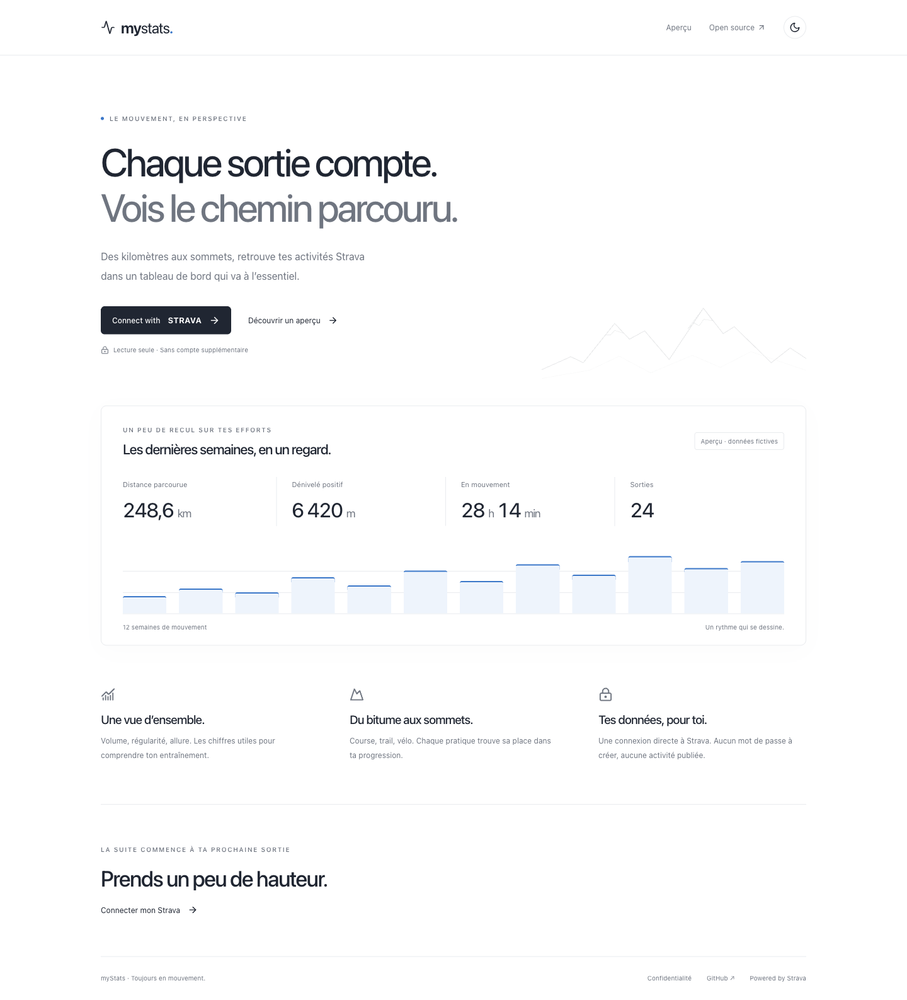
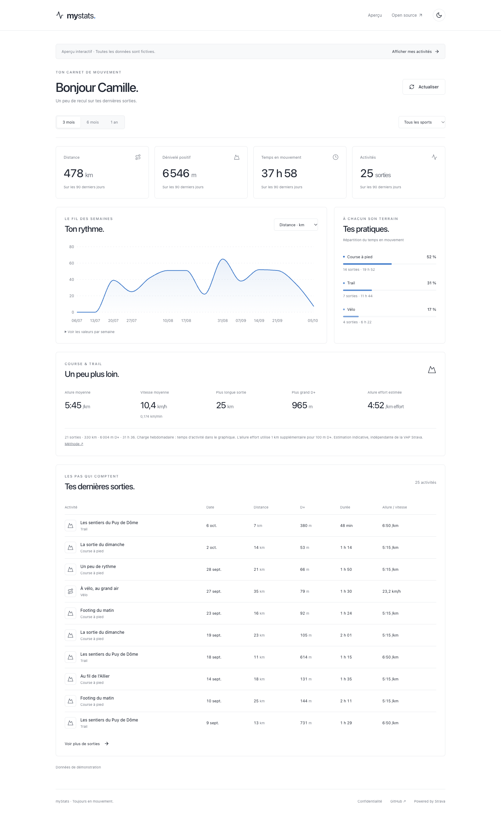
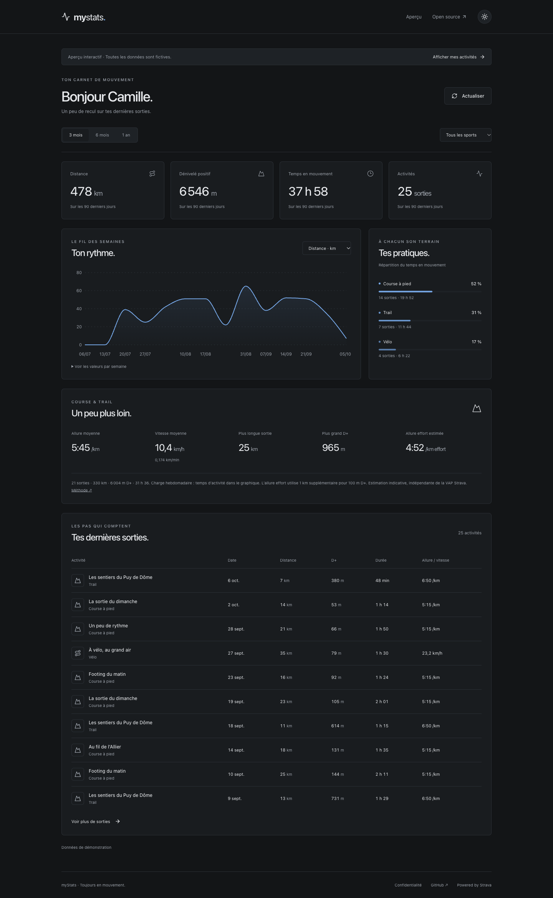

# myStats

**Ton sport, en perspective.** Un tableau de bord Strava sobre pour prendre du recul sur ses sorties. Blanc, noir, graphiques bleus, thèmes clair et sombre.

[](https://github.com/gubgub63/MyStravaStats/actions/workflows/ci.yml)



## Ce que fait l’application

- Connexion directe à Strava, sans compte ni mot de passe supplémentaire.
- Distance, dénivelé positif, temps en mouvement et nombre d’activités.
- Graphique hebdomadaire : distance, D+ ou temps ; répartition du temps par sport.
- Périodes de 3 mois, 6 mois et 1 an, filtres par sport, sorties récentes.
- Course et trail : allure et vitesse pondérées, plus longue sortie, plus grand D+, allure effort estimée.
- Session chiffrée, cache privé de dix minutes, déconnexion et révocation de l’accès.
- Interface responsive, navigation clavier, valeurs des graphiques disponibles dans un tableau.
- `/demo` : aperçu interactif clairement identifié, entièrement fictif, sans appel Strava.



<details>
<summary>Thème sombre et mobile</summary>




</details>

## Démarrer en local

Node.js **22.12 ou supérieur** et npm sont nécessaires.

```sh
git clone https://github.com/gubgub63/MyStravaStats.git
cd MyStravaStats
npm ci
cp .env.example .env.local
npm run dev
```

Ouvre [localhost:3000](http://localhost:3000). L’accueil et `/demo` fonctionnent sans secrets. Pour connecter ton Strava, configure `.env.local` :

| Variable               | Description                                      |
| ---------------------- | ------------------------------------------------ |
| `STRAVA_CLIENT_ID`     | Identifiant de ton application Strava            |
| `STRAVA_CLIENT_SECRET` | Secret client Strava, uniquement côté serveur    |
| `SESSION_SECRET`       | Secret aléatoire d’au moins 32 caractères        |
| `STRAVA_REDIRECT_URI`  | `http://localhost:3000/api/auth/strava/callback` |
| `NEXT_PUBLIC_APP_URL`  | `http://localhost:3000`                          |

Génère un vrai secret de session, puis copie la sortie dans `.env.local` :

```sh
node -e "console.log(require('node:crypto').randomBytes(48).toString('base64url'))"
```

Les secrets restent dans `.env.local`, ignoré par Git. L’application vérifie la configuration au moment de la connexion, sans exiger de secrets dans le job CI qui compile l’interface.

## Créer l’application Strava

1. Depuis ton compte Strava, ouvre [les paramètres API](https://www.strava.com/settings/api) et crée une application de visualisation.
2. Renseigne son nom, son site web et le domaine de rappel. En local, utilise `localhost` ; Strava autorise également `127.0.0.1`.
3. Copie le Client ID et le Client Secret dans `.env.local`. Les tokens personnels visibles sur la page Strava ne servent pas à connecter les utilisateurs de cette application.
4. Lance le site et clique sur **Connect with Strava**. Autorise `read` et `activity:read`.
5. Pour la production, remplace le domaine de rappel par le domaine stable de ton application Vercel et configure les deux URL en HTTPS.

Seules les activités visibles par tous ou par les abonnés sont demandées. Les activités « Moi uniquement », les données de zones privées et les traces GPS ne sont pas lues. Aucun scope d’écriture.

La capture de configuration fournie pour ce projet indiquait **10 athlètes autorisés**, 400 requêtes / 15 minutes et 4 000 / jour, dont 200 lectures / 15 minutes et 2 000 / jour. Ces limites sont propres à l’application : les en-têtes des réponses Strava restent la référence. Une ouverture au-delà de cette capacité nécessite la procédure prévue par Strava. Voir [la documentation OAuth](https://developers.strava.com/docs/authentication/), [les limites](https://developers.strava.com/docs/rate-limits/) et [le démarrage](https://developers.strava.com/docs/getting-started/).

## Hébergement gratuit avec GitHub Actions

GitHub contient le code public et exécute le pipeline. **GitHub Pages sert des fichiers statiques** et ne peut pas exécuter les routes OAuth ni garder le secret client côté serveur. Ce projet Next.js utilise donc **Vercel Hobby** pour l’hébergement gratuit d’un projet personnel non commercial, dans les quotas du plan. [GitHub Pages](https://docs.github.com/en/pages/getting-started-with-github-pages/what-is-github-pages), [Vercel Hobby](https://vercel.com/docs/plans/hobby).

1. Crée un compte Vercel et importe ce dépôt comme projet **Next.js**.
2. Dans les variables d’environnement **Production** Vercel, configure les cinq variables ci-dessus. Utilise un `SESSION_SECRET` différent de celui du développement.
3. Fixe un domaine stable, par exemple le domaine `*.vercel.app` attribué à ton projet. Configure :

   ```env
   NEXT_PUBLIC_APP_URL=https://TON-DOMAINE.vercel.app
   STRAVA_REDIRECT_URI=https://TON-DOMAINE.vercel.app/api/auth/strava/callback
   ```

4. Configure ce domaine dans l’application Strava. Les domaines de preview temporaires ne conviennent pas au callback de production.
5. Dans **GitHub → Settings → Secrets and variables → Actions**, ajoute :

   | Type     | Nom                 | Valeur                             |
   | -------- | ------------------- | ---------------------------------- |
   | Variable | `VERCEL_ORG_ID`     | ID du compte ou de l’équipe Vercel |
   | Variable | `VERCEL_PROJECT_ID` | ID du projet Vercel                |
   | Secret   | `VERCEL_TOKEN`      | Token de déploiement Vercel        |

   Les ID se trouvent dans les réglages Vercel ou dans `.vercel/project.json` après `vercel link`. Ce fichier reste ignoré par Git.

6. Désactive le déploiement Git automatique de Vercel si tu utilises ce workflow, pour éviter deux déploiements par push.
7. Pousse sur `main` ou lance **Actions → Validate and deploy → Run workflow**.

Le pipeline exécute lint, TypeScript, tests, audit des dépendances de production et build, puis télécharge les variables Vercel, compile et déploie avec le CLI Vercel. Le job de déploiement reste désactivé tant que `VERCEL_PROJECT_ID` n’est pas configuré. Les pull requests exécutent les vérifications sans recevoir les secrets de production. [Workflow Vercel officiel](https://vercel.com/kb/guide/how-can-i-use-github-actions-with-vercel).

Après le premier déploiement, vérifie une vraie connexion Strava, la lecture des activités, la déconnexion et la révocation. Les tests simulés ne prouvent pas la validité de tes identifiants ou du domaine de rappel.

## Architecture et sécurité

```text
Navigateur → OAuth Strava → callback serveur
                              ↓
                     cookie chiffré HttpOnly
                              ↓
             /api/dashboard → API Strava → agrégation
                              ↓
                         statistiques
```

Next.js App Router, TypeScript, React, Tailwind CSS, Recharts, Zod et iron-session. Aucune base de données, aucun compte local, aucun stockage permanent des activités.

- Cookie authentifié et chiffré par iron-session, `HttpOnly`, `SameSite=Lax`, `Secure` et préfixe `__Host-` en production.
- Cookie de session navigateur, durée serveur maximale de 24 heures. Les navigateurs qui restaurent les sessions peuvent conserver le cookie après fermeture.
- `state` OAuth imprévisible, scellé, valable dix minutes et supprimé après le callback.
- Tokens exclusivement côté serveur ; renouvellement avec marge de trois minutes et remplacement du refresh token.
- Une seule route principale de données, un refresh au début, regroupement des renouvellements concurrents sur une même instance par résultat chiffré conservé 30 secondes.
- Vérification d’Origin pour les POST de déconnexion et de révocation.
- CSP avec nonce, protection contre l’inclusion dans une iframe, HTTPS en production et en-têtes de sécurité.
- Aucun journal applicatif de tokens, codes OAuth, cookies ou réponses brutes. Journalisation des requêtes Next.js désactivée. Configure aussi la rétention et la suppression des paramètres sensibles dans les logs de ton hébergeur/proxy : le callback reçoit obligatoirement un code OAuth en query string.
- Révocation via `POST /oauth/revoke`, méthode recommandée par Strava depuis juin 2026, avec authentification serveur Basic et token dans le corps de la requête.

### Cache et limites

Le cache **en mémoire** est isolé par identifiant aléatoire de session, athlète, scopes et période. Il ne conserve que les champs nécessaires au dashboard, jusqu’à dix minutes et cent entrées par instance. Il regroupe les lectures concurrentes et purge les entrées de la session à la déconnexion/révocation. Aucun cache partagé public ; les réponses HTTP privées ont `Cache-Control: private, no-store`.

« Actualiser » recharge le dashboard depuis ce cache jusqu’à expiration : il ne permet pas de forcer un appel Strava à chaque clic. Changer de période peut déclencher une nouvelle lecture. Il n’y a aucun polling, aucune synchronisation historique illimitée et aucune persistance navigateur des activités.

La pagination demande au maximum dix pages de cent activités sur la fenêtre sélectionnée. Si la limite est atteinte, un avertissement précise que les résultats sont partiels. Une réponse 429 ou des en-têtes de quotas épuisés bloquent les nouveaux appels sur l’instance jusqu’à la prochaine fenêtre autorisée, sans boucle de retry. Le délai est transmis au navigateur.

**Limites du stateless/serverless :** cache, coalescence et garde de quotas sont propres à chaque instance et disparaissent au redémarrage. Plusieurs instances peuvent effectuer la même lecture ou renouveler simultanément un token. Un ancien cookie copié ne peut pas être révoqué individuellement sans état serveur ; la révocation Strava invalide les tokens. Ce MVP n’apporte donc pas un cache ou une exclusion mutuelle globale. L’architecture reste sans BDD conformément à la spec.

### Calculs

Les sommes utilisent les unités de l’API. L’allure course est pondérée : temps total / distance totale. Le volume hebdomadaire et le temps sont des mesures simples de charge. Les semaines commencent le lundi et utilisent la date locale de l’activité ; les dates UTC restent conservées.

**Allure effort estimée** = temps course en secondes / (distance course en km + D+ en mètres / 100). Cette approximation maison ne tient pas compte des descentes, de la pente instantanée ou du terrain. Elle n’est pas la VAP/GAP Strava. Une VAP précise nécessiterait des données supplémentaires et un modèle explicitement documenté.

### Webhooks

Strava [recommande les webhooks](https://developers.strava.com/docs/webhooks/) pour les changements d’activité et la désautorisation. Ce MVP ne fait aucun polling et ne crée pas de souscription webhook. Avant une ouverture à davantage d’athlètes, revalide les exigences Strava et prévois une invalidation des caches par athlète sur toutes les instances ; un endpoint isolé sur une instance serverless ne garantit pas cette invalidation globale.

## Vérifier et contribuer

```sh
npm run lint
npm run typecheck
npm run test
npm run build
npm audit --omit=dev
```

L’audit des dépendances de production est intégré au pipeline. Au moment de l’installation, l’audit complet signale une vulnérabilité de `braces` transitive aux outils ESLint ; la version corrigée n’est pas encore publiée sur npm. Ces outils ne sont pas importés par le serveur de production. Suivre la mise à jour amont avant de traiter des patterns de glob provenant de sources non fiables.

Les tests couvrent unités, semaines et dates locales, normalisation, sessions invalides, callback OAuth, chiffrement du cookie, renouvellement concurrent, pagination, erreurs 401/403/429/500, cache privé, CSRF, déconnexion et révocation. Aucun appel réseau Strava réel n’est effectué par les tests.

Voir [CONTRIBUTING.md](CONTRIBUTING.md), [SPEC.md](SPEC.md) et [la page de confidentialité](src/app/privacy/page.tsx). Les captures du README proviennent exclusivement de `/demo` et ne contiennent aucune donnée Strava réelle.

Licence [MIT](LICENSE). Strava est une marque de Strava, Inc. Ce projet est indépendant.
