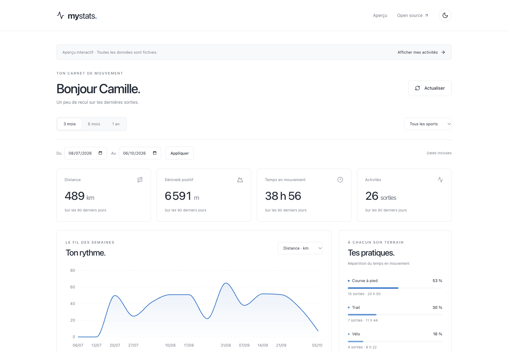
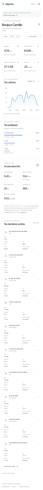

<h1 align="center">myStats</h1>

<p align="center">
  A personal dashboard for your Strava activities.
</p>

<p align="center">
  <a href="https://github.com/gubgub63/MyStravaStats/actions/workflows/ci.yml"></a>
  <a href="LICENSE"></a>
</p>

<p align="center">
  <a href="#getting-started">Getting started</a> ·
  <a href="docs/setup.md">Strava setup</a> ·
  <a href="docs/deployment.md">Deployment</a> ·
  <a href="CONTRIBUTING.md">Contributing</a>
</p>

<picture>
  <source media="(prefers-color-scheme: dark)" srcset="docs/screenshots/preview-dark.png" />
  
</picture>

_Screenshots use sample data. The app interface is currently in French._

## Features

- Distance, elevation gain, moving time and activity totals.
- Weekly charts and a breakdown by sport.
- Running and trail stats: average pace, speed, longest run and highest elevation gain.
- Custom date ranges, sport filters and recent activities.
- Light and dark themes, with layouts for desktop and mobile.
- Strava sign-in, encrypted session cookies and a private ten-minute cache.

No database or additional account required. Built with Next.js, TypeScript, Tailwind CSS and Recharts.

<details>
<summary>Mobile screenshot</summary>

<p align="center">
  
</p>

</details>

## Getting started

Requires Node.js **22.12+** and npm.

```sh
git clone https://github.com/gubgub63/MyStravaStats.git
cd MyStravaStats
npm ci
cp .env.example .env.local
npm run dev
```

Open [localhost:3000/demo](http://localhost:3000/demo) to try the dashboard with sample data. No Strava credentials are needed for the demo.

To load your own activities, [create a Strava application](docs/setup.md) and fill in `.env.local`:

```env
STRAVA_CLIENT_ID=
STRAVA_CLIENT_SECRET=
SESSION_SECRET=
STRAVA_REDIRECT_URI=http://localhost:3000/api/auth/strava/callback
NEXT_PUBLIC_APP_URL=http://localhost:3000
```

Restart the development server and select **Connect with Strava** on the homepage.

## Deployment

The repository includes a [GitHub Actions workflow](.github/workflows/ci.yml) that validates the app and deploys it to Vercel. See the [deployment guide](docs/deployment.md) for environment variables and repository secrets.

A server runtime is required for OAuth and private API calls. GitHub Pages cannot host this app.

## Data and privacy

Strava tokens stay on the server and in an encrypted HttpOnly cookie. Activities are cached in memory for ten minutes and are never written to a database. The app requests read-only access and does not fetch GPS tracks.

Up to 1,000 activities are loaded per period. Larger results are marked as partial. The cache is local to each server instance.

The estimated effort pace shown in the running summary is a custom calculation, **not Strava GAP**. See [architecture and calculations](docs/architecture.md) for details.

## Contributing

Bug reports and pull requests are welcome. Start with the [contributing guide](CONTRIBUTING.md).

```sh
npm run lint
npm run typecheck
npm run test
npm run build
```

## License

[MIT](LICENSE). This project is independent of Strava, Inc.
